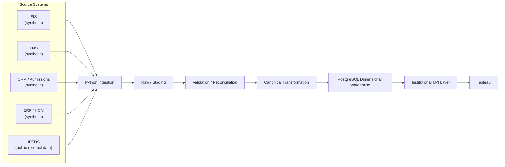

# System Context

## Purpose

This document shows the end-to-end data flow for the University Data Integration & Intelligence Platform: how data moves from source systems, through ingestion and quality/reconciliation processing, into a dimensional warehouse and institutional KPI layer, and finally into Tableau reporting.

It is a context-level view only. It does not define database schemas, table structures, or application code — those are addressed in later design phases.

## Data Provenance

- **SIS, LMS, CRM, ERP/HCM** — synthetic operational data, generated later to represent realistic higher-education records. These do not contain or reproduce real student, employee, or institutional data from any specific university.
- **IPEDS** — public, real external data published by the National Center for Education Statistics (NCES). Used as an institutional benchmark, not as a student-level source of truth.

See [source_systems.md](../source_systems.md) for business purpose, planned entities, and governance/source-of-truth responsibility for each source.

## Pipeline Diagram

## Stage Descriptions

| Stage | Responsibility |
|---|---|
| Source Systems | Origin of record for each domain (see governance rules in [source_systems.md](../source_systems.md)) |
| Python Ingestion | Pulls/loads source extracts into the platform in their native shape |
| Raw / Staging | Landed, untransformed data preserving source structure for traceability |
| Validation / Reconciliation | Data quality checks and cross-source entity reconciliation (e.g., matching a person across SIS, LMS, and CRM) |
| Canonical Transformation | Conforms validated data into shared, canonical business definitions |
| PostgreSQL Dimensional Warehouse | Dimensional model (facts/dimensions) serving as the analytical system of record |
| Institutional KPI Layer | Derived, business-defined institutional metrics built on the warehouse |
| Tableau | Reporting and dashboarding layer consumed by end users |
