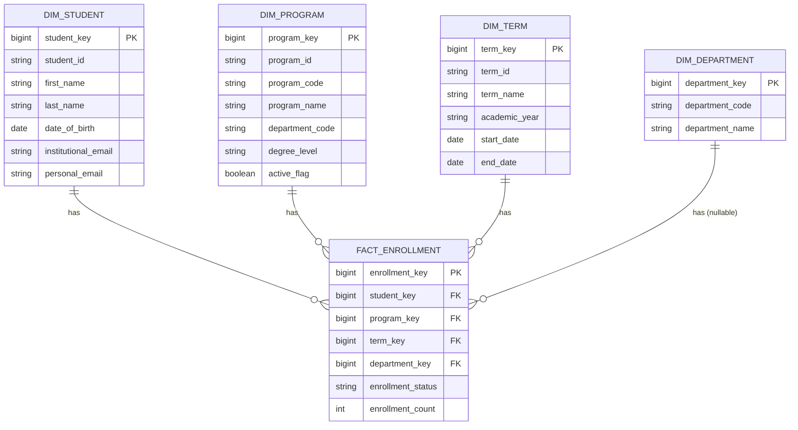

# Enrollment Star Schema (Warehouse Layer, V1)

## Purpose

This document describes the first warehouse-layer dimensional model for
institutional enrollment, implemented in
[sql/warehouse/001_create_enrollment_star_schema.sql](../../sql/warehouse/001_create_enrollment_star_schema.sql).
It restates validated, source-shaped data from the SIS staging layer (see
[sis_source_schema.md](sis_source_schema.md)) as a star schema suited to
analytical querying.

SCD (Slowly Changing Dimension) history is not implemented in this version.
Dimensions are currently loaded as flat, current-state rows.

## Fact vs. Dimension Distinction

- **Fact table** (`fact_enrollment`) records a measurable business event —
  a student's institutional/program enrollment for a term — and holds
  foreign keys to the dimensions that give it context, plus numeric
  measures (`enrollment_count`) and event-level attributes
  (`enrollment_status`).
- **Dimension tables** (`dim_student`, `dim_program`, `dim_term`,
  `dim_department`) hold descriptive attributes used to filter, group, and
  label facts (e.g., a student's name, a program's degree level, a term's
  date range). They change far less frequently than facts and are not
  themselves business events.

## Fact Table Grain

**One row in `warehouse.fact_enrollment` = one student x one program x one
academic term** (equivalently: one student's institutional/program
enrollment in one academic term).

This is the same grain as `staging.sis_enrollments`. It does not represent
course/section enrollment (`staging.sis_course_enrollments`), which is a
finer grain and will be modeled as a separate fact table later.

The grain is enforced by the unique constraint
`uq_fact_enrollment_grain (student_key, program_key, term_key)`. This
constraint intentionally permits the same student to appear more than once
in the same term under different programs (e.g., a double major) — it
enforces one row per student/program/term combination, not one row per
student per term.

### `enrollment_count` is not student headcount

`enrollment_count` is an additive measure that is always `1` at this grain:
it counts fact/program-enrollment records, one per student/program/term
combination. It must **not** be automatically interpreted as, or summed to
produce, unique institutional student headcount. Because a student can hold
multiple program enrollments in the same term, `SUM(enrollment_count)` (or
`COUNT(*)`) over `fact_enrollment` for a term can exceed the number of
distinct students enrolled that term.

Institutional student headcount is a governed business definition. At this
grain, compute it as `COUNT(DISTINCT student_key)` over `fact_enrollment`
grouped/filtered by `term_key` — do not use `SUM(enrollment_count)` or
`COUNT(*)` for headcount. If headcount reporting needs become more central,
a dedicated student-term fact (grain: one student x one term) should be
introduced rather than relying on this fact table for that purpose.

## Surrogate Keys vs. Business Keys

Every dimension has two identifying columns:

- A **surrogate key** (`*_key`), a warehouse-generated
  `BIGINT GENERATED ALWAYS AS IDENTITY` primary key. This is what
  `fact_enrollment` references, and what future SCD Type 2 versioning will
  key off of.
- A **business key** (`*_id` / `department_code`), the original
  source-system identifier, kept `NOT NULL UNIQUE` so each dimension row
  remains traceable back to its source (SIS, or later ERP/HCM for
  department).

Decoupling the fact table from source-system identifiers means the
warehouse is not exposed to source key reuse/format changes, and gives a
stable join key that survives future SCD history being added.

## Dimensions

### warehouse.dim_student

Represents a student, independent of any term or program enrollment.
Sourced from `staging.sis_students`.

| Column | Type | Notes |
|---|---|---|
| student_key (PK) | BIGINT IDENTITY | Surrogate key |
| student_id | VARCHAR NOT NULL UNIQUE | Business key (SIS `student_id`) |
| first_name | VARCHAR NOT NULL | |
| last_name | VARCHAR NOT NULL | |
| date_of_birth | DATE NOT NULL | |
| institutional_email | VARCHAR NOT NULL | |
| personal_email | VARCHAR NULL | |

`dim_student` intentionally has **no `current_program` column** — see
below.

### warehouse.dim_program

Represents an academic program. Sourced from `staging.sis_programs`.

| Column | Type | Notes |
|---|---|---|
| program_key (PK) | BIGINT IDENTITY | Surrogate key |
| program_id | VARCHAR NOT NULL UNIQUE | Business key (SIS `program_id`) |
| program_code | VARCHAR NOT NULL | |
| program_name | VARCHAR NOT NULL | |
| department_code | VARCHAR NOT NULL | Not yet reconciled to `dim_department` |
| degree_level | VARCHAR NOT NULL | |
| active_flag | BOOLEAN NOT NULL | |

### warehouse.dim_term

Represents an academic term. Sourced from `staging.sis_terms`.

| Column | Type | Notes |
|---|---|---|
| term_key (PK) | BIGINT IDENTITY | Surrogate key |
| term_id | VARCHAR NOT NULL UNIQUE | Business key (SIS `term_id`) |
| term_name | VARCHAR NOT NULL | |
| academic_year | VARCHAR NOT NULL | |
| start_date | DATE NOT NULL | |
| end_date | DATE NOT NULL | |

### warehouse.dim_department

Represents the canonical academic department dimension. **This table is
structurally defined but intentionally not yet populated.** The
authoritative source for department data is the institution's ERP/HCM
system, which has not been implemented in this platform yet. No department
data is fabricated in its place.

| Column | Type | Notes |
|---|---|---|
| department_key (PK) | BIGINT IDENTITY | Surrogate key |
| department_code | VARCHAR NOT NULL UNIQUE | Business key (future ERP/HCM department code) |
| department_name | VARCHAR NOT NULL | |

Once the ERP/HCM source is integrated, this dimension will be populated
from it, and `dim_program.department_code` (and, transitively,
`fact_enrollment.department_key`) will be reconciled to it.

## Fact Table

### warehouse.fact_enrollment

| Column | Type | Notes |
|---|---|---|
| enrollment_key (PK) | BIGINT IDENTITY | Surrogate key |
| student_key (FK) | BIGINT NOT NULL | → `dim_student.student_key` |
| program_key (FK) | BIGINT NOT NULL | → `dim_program.program_key` |
| term_key (FK) | BIGINT NOT NULL | → `dim_term.term_key` |
| department_key (FK) | BIGINT NULL | → `dim_department.department_key`; nullable until ERP/HCM reconciliation exists |
| enrollment_status | VARCHAR NOT NULL | e.g., enrolled, withdrawn, on leave |
| enrollment_count | INTEGER NOT NULL DEFAULT 1 | Additive count of fact/program-enrollment records; always 1 at this grain. Not a proxy for student headcount — see [Fact Table Grain](#fact-table-grain). |

Unique constraint: `(student_key, program_key, term_key)` — enforces the
stated V1 grain (one row per student/program/term combination). This
intentionally permits the same student to appear under different programs
in the same term.

## Why Program Is Modeled on the Fact, Not as `current_program` on `dim_student`

A student's program membership is time-variant: it applies to a specific
term and can change from one term to the next (e.g., a student changes
majors). Storing it as a `current_program` attribute on `dim_student` would
overwrite prior history and only ever reflect the student's latest program.

Instead, `program_key` lives on `fact_enrollment`, so each term's program
enrollment is its own fact row. This preserves a full, queryable history of
which program a student was enrolled in for every term they had an
enrollment record, matching the source system's modeling
(`sis_enrollments` ties one student to one program for one term).

## Why `dim_department` Is Designed but Not Yet Populated

`dim_department` is included now because it is part of the target
warehouse architecture and `fact_enrollment.department_key` needs a
dimension to reference. However, the authoritative source for department
data is the ERP/HCM system, which is out of scope for this stage of the
platform. Populating `dim_department` from `dim_program.department_code`
(or any other non-authoritative source) would risk fabricating or
prematurely canonicalizing department data. Instead:

- `dim_department` is created empty, as a structural placeholder.
- `fact_enrollment.department_key` is nullable so fact loads are not
  blocked on this dimension.
- When the ERP/HCM source is implemented, `dim_department` will be loaded
  from it, and existing `department_code` values elsewhere in the warehouse
  will be reconciled to it.

## Star Schema Diagram

