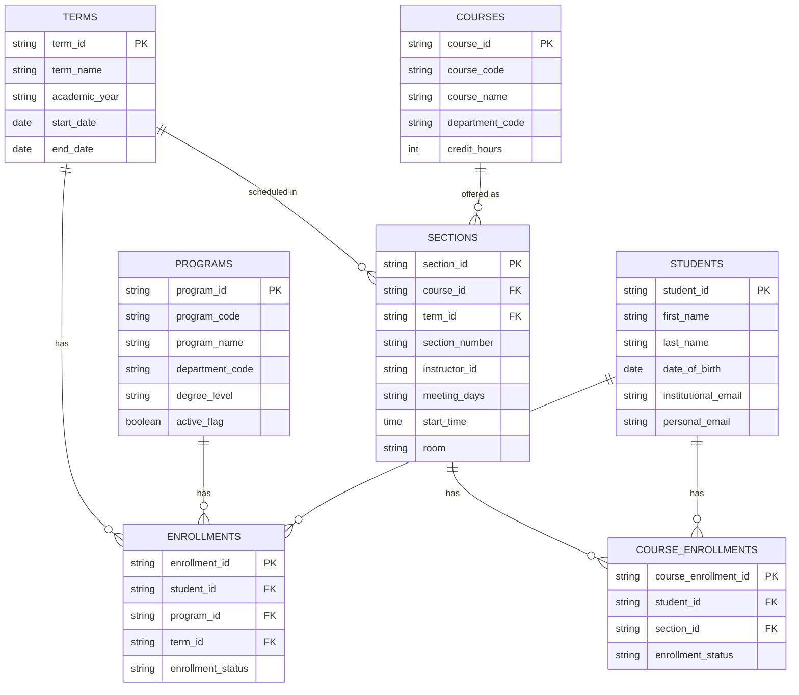

# SIS Source Schema (Design Documentation)

## Purpose

This document defines the proposed synthetic SIS-like source model referenced in [source_systems.md](../source_systems.md). It is design documentation only — no database tables, SQL DDL, Python code, or datasets are created by this document.

The SIS-like source is the authoritative source for official student enrollment and academic program information (see governance rules in [source_systems.md](../source_systems.md)).

## Key Modeling Distinctions

- **Course vs. Section** — `courses` is the reusable catalog definition of a course (e.g., "CS 101 — Intro to Programming"). `sections` is a specific offering of a course in a specific term (e.g., "CS 101, Section 002, Fall 2025").
- **`enrollments` vs. `course_enrollments`** — `enrollments` represents a student's institutional/program enrollment for a term (i.e., the student is enrolled at the institution, in a given program, for a given term). `course_enrollments` represents a student's enrollment in a specific course section.
- **Students and sections are many-to-many**, resolved through the `course_enrollments` associative entity: one student can enroll in many sections, and one section can have many students enrolled.
- **No denormalized descriptive attributes in transactional tables.** Transactional/associative tables (`enrollments`, `course_enrollments`, `sections`) store foreign keys only. Descriptive values such as `program_name`, `course_name`, or term details are not duplicated into these tables — they are resolved by joining to `programs`, `courses`, and `terms` respectively.

## Entities

### 1. students

**Business purpose:** Represents an individual student known to the institution, independent of any specific term, program enrollment, or course enrollment.

| Field | Required / Nullable | Business Definition |
|---|---|---|
| student_id (PK) | Required | Source-system unique identifier for the student. |
| first_name | Required | Student's legal first name. |
| last_name | Required | Student's legal last name. |
| date_of_birth | Required | Student's date of birth, used for identity verification and reconciliation. |
| institutional_email | Required | Official university-issued email address assigned to the student. |
| personal_email | Nullable | Personal email address supplied by the student, typically collected prior to institutional email issuance (e.g., during admissions). |

**Primary key:** `student_id`
**Foreign keys:** None
**Relationships:** One student may have many `enrollments` (across terms/programs) and many `course_enrollments` (across sections).

### 2. programs

**Business purpose:** Represents an academic program (major, degree, or credential track) that a student can be enrolled in.

| Field | Required / Nullable | Business Definition |
|---|---|---|
| program_id (PK) | Required | Unique identifier for the academic program. |
| program_code | Required | Short institutional code identifying the program (e.g., "CS-BS"). |
| program_name | Required | Full descriptive name of the program (e.g., "Computer Science, B.S."). |
| department_code | Required | Code identifying the academic department that owns the program. |
| degree_level | Required | Level of credential awarded by the program (e.g., undergraduate, master's, doctoral). |
| active_flag | Required | Indicates whether the program is currently active and available for new enrollment. |

**Primary key:** `program_id`
**Foreign keys:** None
**Relationships:** One program may have many `enrollments` (many students enroll in the same program across terms).

### 3. terms

**Business purpose:** Represents an academic term (e.g., a semester or session) used to scope enrollment and course offerings in time.

| Field | Required / Nullable | Business Definition |
|---|---|---|
| term_id (PK) | Required | Unique identifier for the academic term. |
| term_name | Required | Human-readable name of the term (e.g., "Fall 2025"). |
| academic_year | Required | Academic year the term belongs to (e.g., "2025-2026"). |
| start_date | Required | Date the term begins. |
| end_date | Required | Date the term ends. |

**Primary key:** `term_id`
**Foreign keys:** None
**Relationships:** One term may have many `sections` (offered that term) and many `enrollments` (students enrolled that term).

### 4. courses

**Business purpose:** Represents the reusable catalog definition of a course, independent of any specific term or offering.

| Field | Required / Nullable | Business Definition |
|---|---|---|
| course_id (PK) | Required | Unique identifier for the course catalog entry. |
| course_code | Required | Institutional course code (e.g., "CS 101"). |
| course_name | Required | Descriptive title of the course (e.g., "Introduction to Programming"). |
| department_code | Required | Code identifying the academic department that owns the course. |
| credit_hours | Required | Number of credit hours the course is worth. |

**Primary key:** `course_id`
**Foreign keys:** None
**Relationships:** One course may have many `sections` (one per term it is offered).

### 5. sections

**Business purpose:** Represents a specific offering of a course within a specific term, including scheduling and instructor details.

| Field | Required / Nullable | Business Definition |
|---|---|---|
| section_id (PK) | Required | Unique identifier for the section (specific course offering). |
| course_id (FK) | Required | References the catalog course this section is an offering of. |
| term_id (FK) | Required | References the term in which this section is offered. |
| section_number | Required | Institutional identifier distinguishing this section from others of the same course in the same term (e.g., "002"). |
| instructor_id | Nullable | Identifier of the instructor of record for the section; nullable because a section may be created before an instructor is assigned (e.g., "staff/TBA"). |
| meeting_days | Nullable | Days of the week the section meets; nullable for sections without fixed in-person meeting days (e.g., asynchronous online sections). |
| start_time | Nullable | Scheduled start time of the section's meetings; nullable for sections without a fixed meeting time. |
| room | Nullable | Physical room where the section meets; nullable for online or no-room sections. |

**Primary key:** `section_id`
**Foreign keys:** `course_id` → `courses.course_id`; `term_id` → `terms.term_id`
**Relationships:** Each section belongs to one course and one term. One section may have many `course_enrollments` (many students enrolled in it).

### 6. enrollments

**Business purpose:** Represents a student's institutional enrollment in a program for a given term — the authoritative record that the student is enrolled at the institution, in a given program, during that term.

| Field | Required / Nullable | Business Definition |
|---|---|---|
| enrollment_id (PK) | Required | Unique identifier for the institutional/program enrollment record. |
| student_id (FK) | Required | References the student holding this enrollment. |
| program_id (FK) | Required | References the academic program the student is enrolled in. |
| term_id (FK) | Required | References the term the enrollment applies to. |
| enrollment_status | Required | Status of the student's institutional enrollment for the term (e.g., enrolled, withdrawn, on leave). |

**Primary key:** `enrollment_id`
**Foreign keys:** `student_id` → `students.student_id`; `program_id` → `programs.program_id`; `term_id` → `terms.term_id`
**Relationships:** Each enrollment record ties one student to one program for one term. A student may have multiple enrollment records across different terms (and, if changing programs, across different programs).

### 7. course_enrollments

**Business purpose:** Represents a student's enrollment in a specific course section — the record resolving the many-to-many relationship between students and sections.

| Field | Required / Nullable | Business Definition |
|---|---|---|
| course_enrollment_id (PK) | Required | Unique identifier for the course-section enrollment record. |
| student_id (FK) | Required | References the student enrolled in the section. |
| section_id (FK) | Required | References the section the student is enrolled in. |
| enrollment_status | Required | Status of the student's enrollment in this section (e.g., enrolled, dropped, completed). |

**Primary key:** `course_enrollment_id`
**Foreign keys:** `student_id` → `students.student_id`; `section_id` → `sections.section_id`
**Relationships:** Each course_enrollment record ties one student to one section. This entity resolves the many-to-many relationship between `students` and `sections`: a student may be enrolled in many sections, and a section may have many students enrolled.

## Entity-Relationship Diagram

